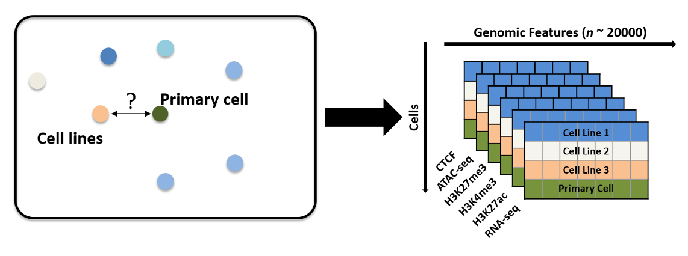
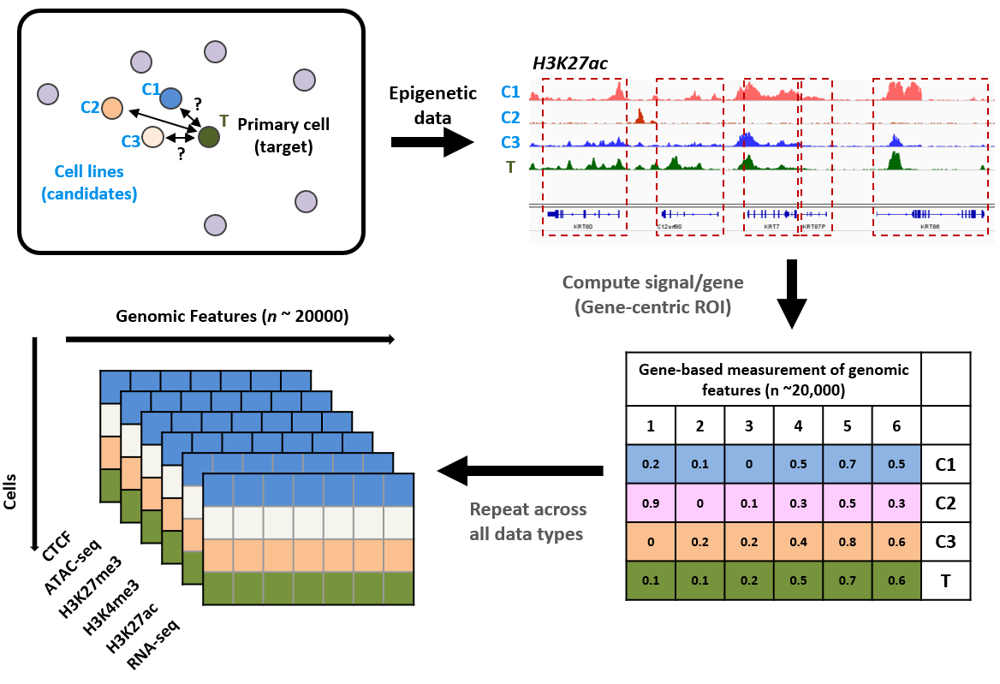
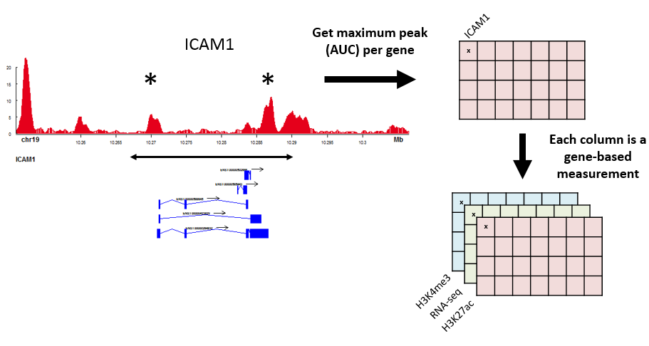

epiChoose is an application for quantifying the relatedness between cell lines and primary cells. For a **Quick Start**:

1. See what cell lines and primary cells have been profiled in **Data Overview**.
2. Explore relatedness between samples using specific gene selections (gene lists, ontologies, etc.) using **Data Exploration**.
3. Select data type and samples to download (BAM or Bigwig) in **Download**.
4. Explore integrating across epigenetic and expression data to define relatedness in **Data Integration**.
5. Select different gene mapping methods for the epigenetic data in **Advanced**.

For some background, please read below ...

***
## Overview ##

In an effort to make choosing a cell line model for a particular cell type or biology a more data-driven decision, Open Targets have profiled a number of commonly used cell lines and relevant primary cells. The following assays have been used for this profiling:

- RNA-seq
- ChIP-seq (H3K27ac, H3K4me3, H3K27me3, CTCF)
- ATAC-seq
- SNP6

The cell lines and cell types that have been profiled have been sub-divided by tissue:

- Project 1 - Haematopoietic models: K562, KU812, MEG01, F36P, UT7, HEL9217
- Project 2 - Monocyte-macrophage differentiation models: THP-1 and U937 (with PMA/VD3/LPS stimulation)
- Project 3 - Lung models: A549 and BEAS-2B
- Project 4 - Liver models: HEP3B, HEPARG, HEPG2 (2D and 3D cultures)
- Project 5 - T-cell models: Jurkat and HUT-78 (+/- CD3 and CD28)
- Project 6 - B-cell models: Ramos, Toledo, Raji, ARH77, Namalwa
- Blueprint - For comparison, a large number of haematopoietic primary samples have been imported from Blueprint 
- ENCODE - Cell lines and primary cells that were profiled with the relevant assays were also imported

***
## Method ##

One of the goals of this project was to **integrate** across epigenetic and expression data to better understand relatedness between cell types and their potential cell line models. In order to perform this intergration, each data type had to be processed so the information across data types could be compared. The workflow above shows how this was performed for the epigenetic (non-expression) data:

1. For each data type, the cell lines and cell types to compare are chosen ...
2. Using the [signal file](https://genome.ucsc.edu/goldenpath/help/bigWig.html) for that particular data type and cell, the Area Under the Curve (AUC) is calculated across regions of interest (ROI).
3. When this is done across all cells of interest, a matrix is produced for that data type where each row is a cell type / cell line, each column is an ROI and the cells contain the AUC for that data type.
4. Hence, each data type produces a matrix that can be compared and contrasted using further statistical and analysis techniques (e.g. PCA).

***
### Expression - Epigenetic Comparisons

Using the method above produces a set of matrices that are comparable across the epigenetic datasets but not against the expression (RNA-seq) data. i.e. the ROIs for the epigenetic data types could be inter- and intragenic regions (e.g. promoters and enhancers), whereas, by definition, the ROIs for the RNA-seq can only be the genes themselves.

In order to compare the epigenetic and expression data, columns of each of the data type matrices must be a gene and hence the epigenetic ROIs must be mapped to genes. The epigenetic assays that we have used (H3K27ac, H3K4me3, H3K27me3, CTCF, ATAC-seq) are the "footprint", or markers, of active regulatory activity in that cell type. These features can affect genes either in close proximity or distal to the gene in question. Ideally, in order to map these active regulatory regions that have been pinpointed by these epigenetic assays, functional assays such as Chromosome Conformation Capture would be used. However, a good approximation can be made by simply taking a window around the gene and taking the largest peak (maximum AUC) for that window as the value for that gene. Using this method, each gene is given an epigenetic score, which can then be compared and contrasted with the expression value for that gene.

***

