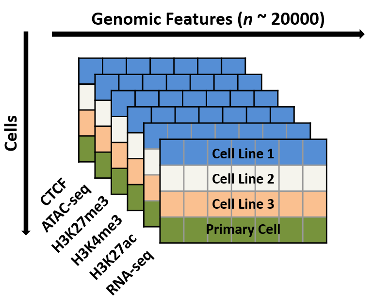

We are currently testing a number of methods that work across all the data for each cell type to produce an integrated metric of relatedness. The results of this will be available in the next release of the platform.

