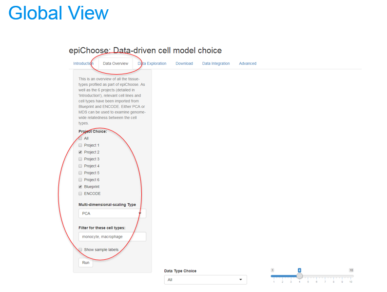

## Introduction ##

We have a starting gene list of possible targets that could modulate the upregulation of Type I Interferon signaling across a number of autoimmune diseases. We want to further interrogate these genes in a cell model. In this case, we have a choice between THP-1 and U937. We will use the **epiView** Shiny app to examine how these genes behave in the 2 cell lines and their relatedness to primary cell types from Blueprint.

```{r echo=FALSE, message=FALSE, warning=FALSE}
require(tidyverse)
require(knitr)
```


```{r echo=FALSE, message=FALSE, warning=FALSE}
my_genes = read_tsv("ifn_list_52.txt", col_names=FALSE)
print(my_genes$X1)
```

## Overview ## 

Before starting with a specific gene list, you might want to compare the candidate cell models and the primary data across the whole genome. This can be performed under the **Data OVerview** tab. The THP-1 and U937 cell lines were profiled as part of **Project 2**. Hence, we can select Project 2 from the left panel. Since THP-1 and U937 are models of primary monocytes/macrophages, we will also select **Blueprint** from the left panel and manually select monocytes and macrophages from the text box underneath.




