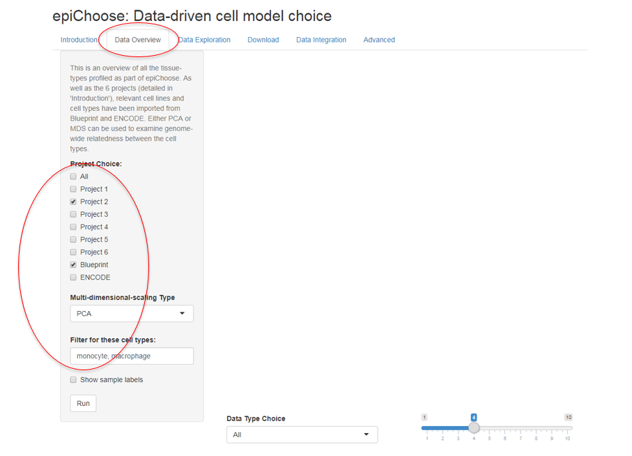
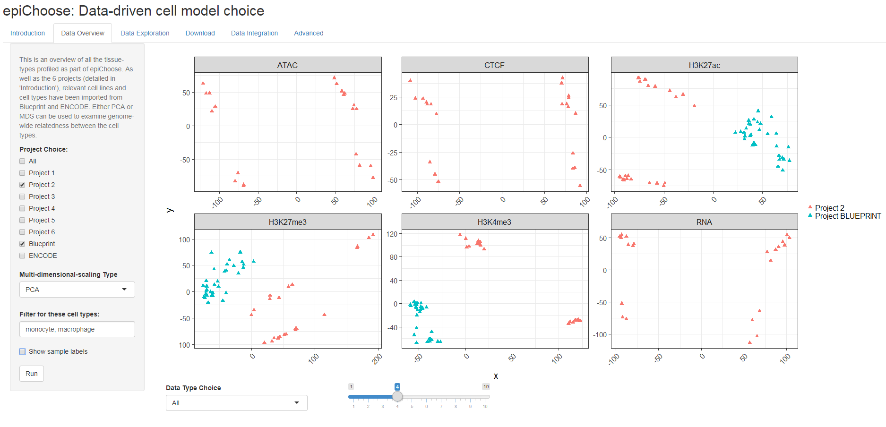
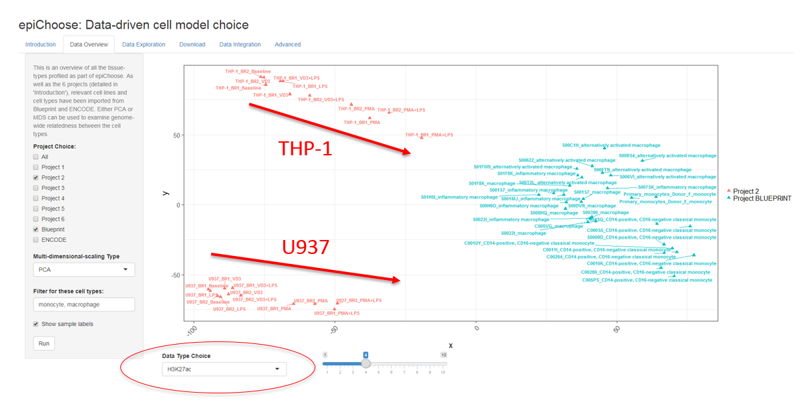
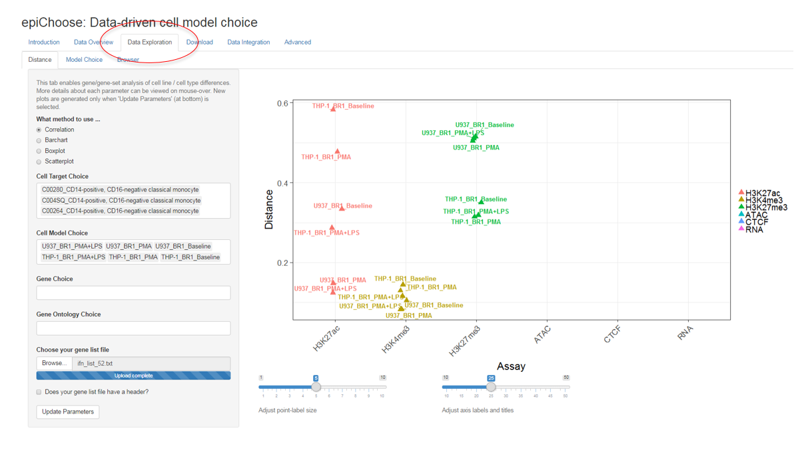

## Introduction ##

We have a starting gene list of possible targets that could modulate the upregulation of Type I Interferon signaling across a number of autoimmune diseases. We want to further interrogate these genes in a cell model. In this case, we have a choice between THP-1 and U937. We will use the **epiView** Shiny app to examine how these genes behave in the 2 cell lines and their relatedness to primary cell types from Blueprint.

```{r echo=FALSE, message=FALSE, warning=FALSE}
require(tidyverse)
require(knitr)
```


```{r echo=FALSE, message=FALSE, warning=FALSE}
my_genes = read_tsv("ifn_list_52.txt", col_names=FALSE)
print(my_genes$X1)
```

## Overview ## 

Before starting with a specific gene list, you might want to compare the candidate cell models and the primary data across the whole genome. This can be performed under the **Data Overview** tab. The THP-1 and U937 cell lines were profiled as part of **Project 2**. Hence, we can select Project 2 from the left panel. Since THP-1 and U937 are models of primary monocytes/macrophages, we will also select **Blueprint** from the left panel and manually select monocytes and macrophages from the text box underneath.



After selecting the type of analysis you wish to perform (**PCA** or **MDS**), pressing **Run** produces multi-dimensiional scaling plots of the selected samples for each data type.



The drop-down menu at the bottom can be used to select specific data types. In this case, by selecting H3K27ac, we can see a shift towards primary cell type patterns with the addition of PMA and LPS in both THP-1 and U937:



## Specific Loci ##

To look at the differences at more specific loci, the **Data Exploration** tab can be selected. The selections on the left side take 3 categories:

1. **What method to use ...** Different methods of comparison. More details are available by hovering over the selection

2. **Cell Choice** This is split into 'Cell Target Choice' and 'Cell Model Choice' i.e. the choice of primary cells (or targets) and the possible cell models

3. **Gene Choice** The loci over which to make your comparisons can be entered manually ('Gene Choice'), by ontology ('Gene Ontology Choice'), or can be uploaded ('Choose your gene list file'). If more than 1 method is chosen, the gene choice is combined.



Once the cell and gene selections have been made, **Update Parameters** can be selected (bottom left) and the selected plot will appear in the main panel. **Correlation** has been selected in the figure above. This gives the distance, in terms of Pearson correlation, between the cell models and the target cells for each data type i.e. the lower the cell model is on the y-axis, the closer it is to the target cells based on the similarity of signal for that data type at the loci selected. If more than 1 target cell is chosen (as in this case, where we have chosen a number of primary monocytes), the average value across the target cells will be used for the correlation.

Returning to the data, let's look at the suitability of THP-1 and U937 with a number of treatments (baseline/PMA/PMA+LPS) as models for primary CD14+/CD16- monocytes based on the uploaded gene list. For the **Correlation** plot above, we see that the U937 models seem to be closer to the primary monocytes based on the H3K27ac signal at the selected loci.

